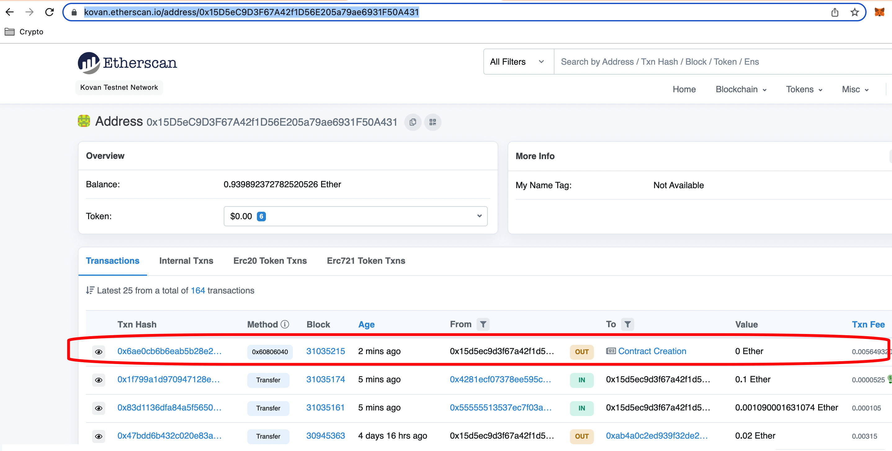
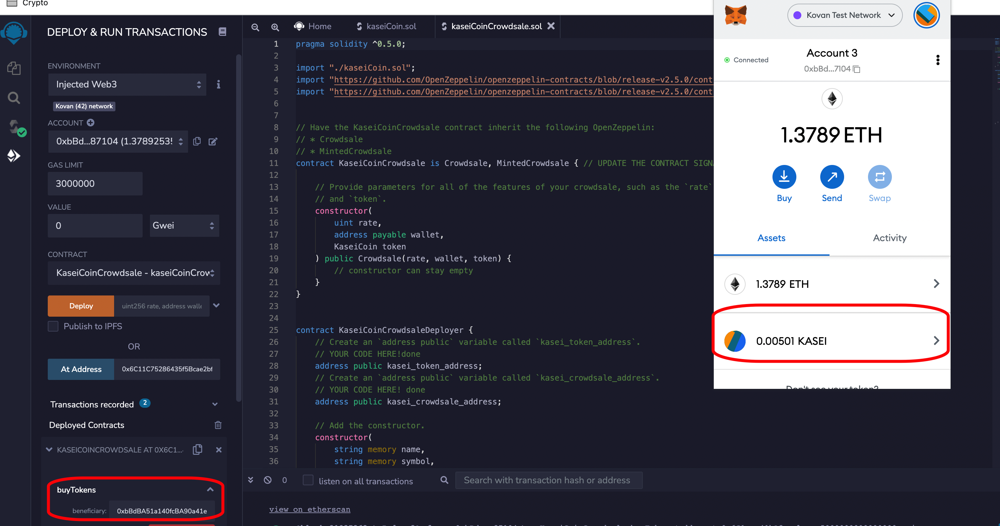
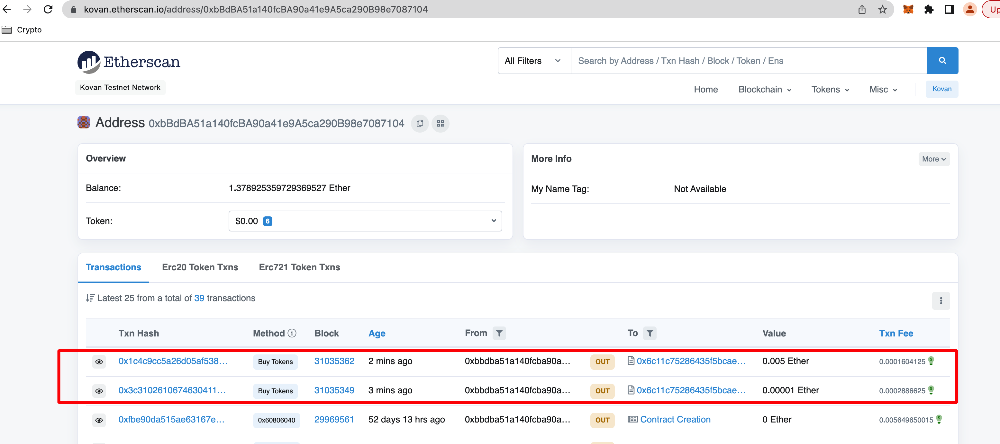
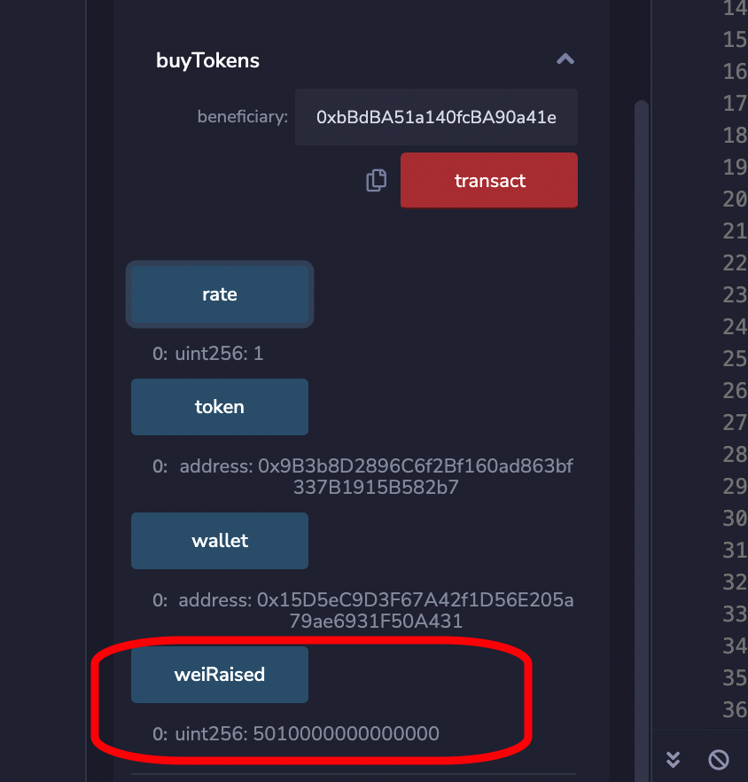
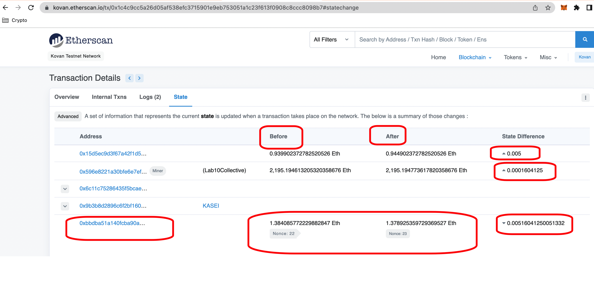

# CrowdSale

Developed a new monetary system using blockchain technology to define a new cryptocurrency named KaseiCoin. KaseiCoin will be a fungible token that’s ERC-20 compliant.. This will launch a crowdsale that will allow people convert their money to KaseiCoin.

## Background

After waiting for years and passing several tests, the Martian Aerospace Agency plans to become part of the first human colony on Mars. This project will develop a monetary system for the new Mars colony. This new system will be implemented on blockchain technology and to define a new cryptocurrency named **KaseiCoin**. (Kasei means Mars in Japanese.)

## Smart Contracts - Remix IDE

3 Solidity contracts are created:

- KaseiCoin Token Contract
- KaseiCoin Crowdsale Contract
  - inherit the following OpenZeppelin contracts:
    - Crowdsale
    - MintedCrowdsale
  - Created features of crowdsale, such as rate, wallet (where to deposit the funds that the token raises), and token. Configured these parameters as KaseiCoin token.
- KaseiCoin Deployer Contract
  - Stores the addresses of the KaseiCoin and KaseiCoinCrowdsale contracts, which this contract will deploy
  - KaseiCoinCrowdsaleDeployer renounces its minter role

[**KaseiCoin.sol**](https://gist.github.com/rchak007/ee86627076c9b495042140f5044d0f5a#file-kaseicoin-sol)

[**KaseiCoinCrowdsale.sol**](https://gist.github.com/rchak007/5992c07657ac6221a3c0443d48f196c5#file-kaseicoincrowdsale-sol)

Created a fungible token that’s ERC-20 compliant. This token will be minted by using a `Crowdsale` contract from the OpenZeppelin Solidity library.

The crowdsale contract will manage the entire crowdsale process. This process will allow users to send ether to the contract and receive KaseiCoin tokens in return. The contract will automatically mint the tokens and distribute them to a buyer in one transaction.

## Deployment - MetaMask / Kovan Ethereum Testnet

Deployed the crowdsale to a Kovan testnet Ethereum blockchain by using Remix, MetaMask.

Deployed KaseiCoinCrowdsaleDeployer - 

0xa27eB8AF3061CA991a7CeBAF218C5bB6E786BA27

Deployment hash:

https://kovan.etherscan.io/tx/0x6ae0cb6b6eab5b28e275f9db5387738a3f472fcc2ce2747ce2e9795a3fb0bb04

deployed at address - 0x15D5eC9D3F67A42f1D56E205a79ae6931F50A431

KaseiCoinCrowdsale address - 0x6C11C75286435f5Bcae2bfDd603F0D4D33941bA2

Token address created: 0x9B3b8D2896C6f2Bf160ad863bf337B1915B582b7

## Buy Kasei token

Bought from Address - 0xbBdBA51a140fcBA90a41e9A5ca290B98e7087104

## Kasei Tokens Raised

## Etherscan State

You can also look at the State that shows before and After balances that went for this transaction hash - 

